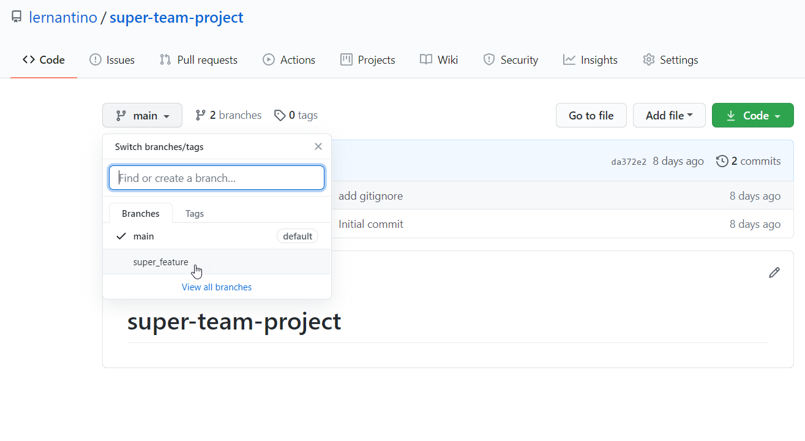
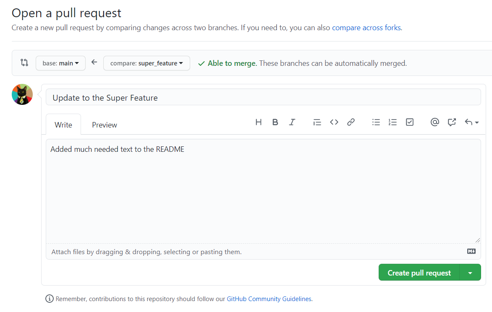
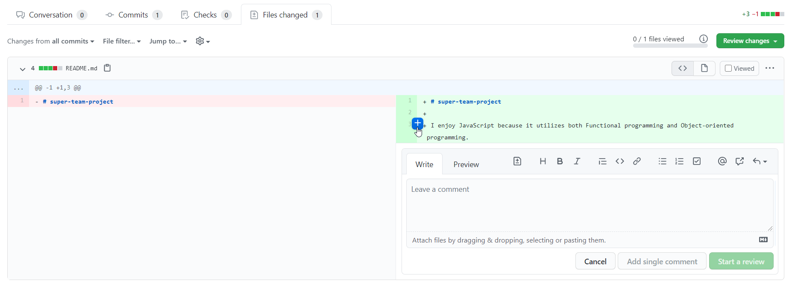

# Git Collaboration Flow

In this activity, we will walk through a situation to learn how to effectively collaborate with other developers on a web application that is hosted on GitHub. When working with a team, it's crucial for all members of the team to agree on a workflow that ensures both the team's happiness and the application's integrity. In web development, this workflow typically revolves around the use of Git and GitHub.

Having multiple developers work with code in a single repository can be hectic. To avoid conflict, developers must record and communicate changes effectively. Having multiple branches and all the information in a centralized location like GitHub provides workflows that are easy to set up and that developers can rely on.

## Instructions

Please refer to `25-Stu_Git-Repo-Setup` for instructions. This is a continuation of that activity.

### Create a New Feature Branch

Github allows us to create multiple branches off of the `main` branch. This enables us to test multiple features at a time. By doing this, we can have multiple people working on a project without breaking the `main` branch.

* Once you have the command line open, confirm that you are in the right directory by using the following command:

    ```
    cd super-team-project
    ```

* You should now be inside your repository's directory. Now we have to create a new branch on this repository where we can work without the changes affecting the `main` branch. To do this, enter the following command:

    ```
    git checkout -b super_feature
    ```

* In the command line, you should see the following code:

    ```text
    Switched to a new branch 'super_feature'
    ```

### Commit Changes to Feature Branch and Test Locally

* Now that you have a new branch, it is time to make some changes. In the `README.md`, add a few lines describing your favorite part of JavaScript so far. Don't spend too much time on this; just write a sentence or two. See the following example:

    ```
    I enjoy JavaScript because it utilizes both Functional programming and Object-oriented programming.
    ```

* Once we have made changes to the `super_feature` branch, it is time to confirm that the project still runs locally.

* If the project and its new feature are running as intended, we will save those changes to the `super_feature` branch. We do that with the following commands:

    ```
    git add
    git commit -m "This is committing the changes I made locally"
    ```

* With `git add` we move the changes to a staging area, which tells Git that we want to group these changes in Git. It is important to know that `add` does not change the repository. The repository will change once you `commit` the changes.

### Push Feature Branch and Open Pull Request

* When you are happy with your new feature and you have tested it, it is time to open a pull request.

* Before we can make a pull request on Github, we first need to push the new feature to Github, with the following command:

    ```
    git push origin super_feature
    ```

* After pushing your branch, you should see something like the following code in your command line:

    ```text
    Total 0 (delta 0), reused 0 (delta 0), pack-reused 0
    remote:
    remote: Create a pull request for 'super_feature' on GitHub by visiting:
    remote:     https://github.com/lernantino/super-team-project/pull/new/super_feature
    remote:
    To https://github.com/lernantino/super-team-project.git
    * [new branch]     super_feature -> super_feature
    ```

* With the `super_feature` branch now on Github, it is time for us to open a pull request. A pull request will let team members know the new `super_feature` branch is ready to be implemented to the `main` branch.

* Navigate to the `super_feature` branch on Github by going to your repository page. On your repository's Github page, look for the dropdown menu called `main`. Select it, and you should see the branches off of your `main` branch. Select `super_feature`, as shown in the following image:

    

* Once we have chosen the correct branch, a green "Compare & pull request" button should appear, like in the following image:

    

* When you are creating a pull request, it is best practice to be as descriptive as possible. It is important to let your team know exactly what you changed. 

* Select the "Create pull request" button so that it can be reviewed, as shown in the following image:

    

    > **Important:** Before submitting a pull request, make sure that you are comparing your branch to `main`.

### Review Pull Request

* Earlier, we created a rule that requires developers to open a pull request and have that pull request reviewed before merging a branch with `main`, as shown in the following image:

    

* On the right-hand side, you should see a Reviewers label. You can use this when you want a particular team member to review your pull request. The selected reviewer will be notified when the pull request is submitted. For the sake of this activity, you will also play the role of reviewer. Normally you will have some type of agreement amongst your team on how to review a pull request. See the following image for reference:

    

* Okay, you now have a pull request, but it is important that one of the team members (in this case, you) carefully reviews the pull request for any mistakes that could potentially break the `main` branch.

* We have to navigate to the repository on GitHub and select the "Pull requests" tab, as shown in the following image:

    

* On this tab, you will see a list of all the pull requests for the specified branch. Right now you should only see the pull request you made, but when you are working on bigger projects this number increases based on how often you make changes to your project. 

    See the following image for reference:

    

* On the Pull Request page, you should see a Files Changed tab, as shown in the following image:

    

* To make comparing code less painful and increase efficiency, in this view you will see a side-by-side comparison of what exactly has changed in your repository&mdash; as shown in the following image:

    

*  In the top-right corner, you should see a green "Review changes" button. When you select "Review changes", a form will appear, and you will have a few options. You can send a comment, send a comment along with approval to merge, or send a comment with changes that need to be made before merging. These tools play a key role in ensuring that your team stays focused and productive. 

    See the following image for reference:

    

* It is important to carefully review all the changes so that no unwanted bugs break your `main` branch.

### Merge Feature Branch and Close Pull Request

* We are approaching the final step. It's time to merge the branch with the `main` branch!

* Once the pull request has been reviewed and tested, you will navigate to the appropriate pull request on Github. Locate and select the green "Merge pull request" button, shown in the following image:

    

* You can add a comment with your merge before clicking Confirm.

* Now you have merged your `super-feature` branch with the `main` branch! Github gives you the option to delete the branch you merged, but that might not always be ideal. Always check in with your team members before deleting a branch.

    See the following image for reference:

    

### Hints

Ask an instructor or TA if you get stuck or have any questions! Check the [GitHub guide on collaboration flow](https://guides.github.com/introduction/flow/) for reference.


======================================
Solved